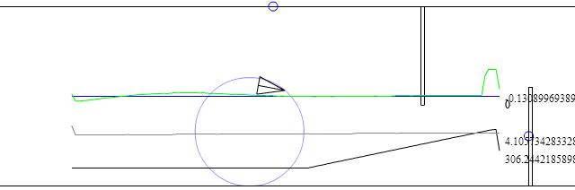
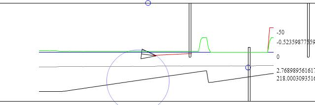
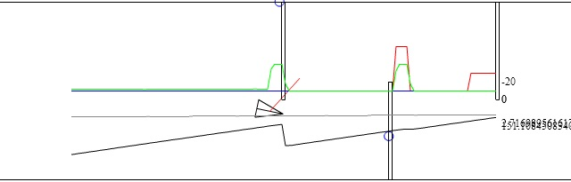
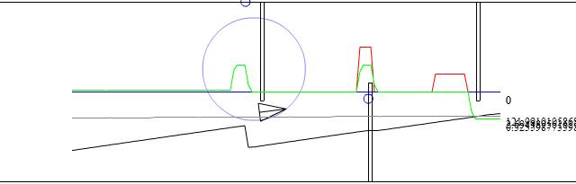
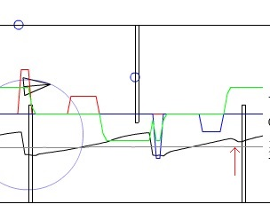

<h1>无动力小车</h1>
By 虾米麻烦

# 传感器

## 一、陀螺仪 

带加速度陀螺仪的六轴姿态传感器MPU6050在此应用的主要作用是利用陀螺仪进行积分得到当前的绝对角度，提供一个绝对方向参考信息，从而进行更稳定地控制。

	G-G0 -Inte-> A+A0

式 1-1

其中G为陀螺仪原始输出值，G0为校准偏置，A为陀螺仪积分姿态解算出的Z轴绝对角度测量值，A0为绝对角度校准偏置。

## 二、侧面超声波测距

侧面超声波测距传感器主要用在辅助滑行阶段进行直线滑行，结合陀螺仪，可准确计算出传感器距离墙面的垂直距离

	D ───┐
	A+A0 --> L=D*cos(A+A0)

式 1-2

其中D为超声波测距值，L为由绝对角度与测距值计算出的垂直距离。

# 运行

## 一、校准

### 1、陀螺仪上电校零

上电后1S时自动校零，上电后若发现陀螺仪有一定的积分误差，可进行积分校准。

### 2、陀螺仪积分校零

通过朝向正方向静止放置并按下按钮S2后,进行陀螺仪校准,用时3秒。

	G0 = Inte{0,T}(G * dt) / T
	G0 = SUM{0,T}(G) / T

式 2-1

其中：G为陀螺仪原始输出，G0为校准值，T为积分时间，Inte为积分，SUM为离散积分（求和）。

### 3、舵机校零

前叉、舵机在安装中会出现前轮零点角度误差，该误差较大的话会导致车在运行中出现路径偏差。故需要进行舵机零点校准。

在误差非常大的情况下先通过程序、串口调参进行手动校准。

运行时可通过陀螺仪Z轴角度变化率动态调整舵机零点。

	A = k * Inte{0,S}((a + a0) * ds)

式 2-2

其中，A为Z轴绝对角度测量值，a为控制器输出舵机角度，a0为角度偏差量，k为结构决定的系数，s为路程，`s=Inte{0,T}(v*dt)`。

但由于s与k无法得知，故动态调整采用PID控制器在滑行阶段进行舵机动态校零,

	s = Inte{0,T}(v * dt)
	dA / dt = (k * v) * (a + a0)
	当dA / dt = 0:
	a + a0 = 0

式 2-3

其中，v为速度，t为时间。

只需要通过PID算法，在滑行阶段将`(L-Ls) -> 0`，当`(L-Ls)`稳定时也将满足`dA / dT -> 0`，即可得出a的修正量-a0。

	Ls ─┐
	L --> PID -> sin(As) -asin-> As

	As ───┐
	A+A0 -> PID -> sin(a) -asin-> a ---> G

式 2-4 滑行阶段串级PID控制

其中，As为绝对角度期望设定值。

当系统误差在一定范围内时，该控制系统将保证滑行方向趋于赛道方向，故当`(L-Ls)`稳定时，车将沿着赛道方向前进，此时的a即修正值-a0。输出`a=ax-a0`，ax为理想输出角度。

### 4、绝对角度校零

绝对角度A由校准后的陀螺仪输出G-G0经过姿态解算后得到，是一个积分过程，故因起始位置摆放等问题会出现绝对角度A出现零点偏移，即A=0时实际指向与赛道方向仍存在误差A0，会导致路径出现偏差。

由[式 2-4](#s-2-4)可知，当`(L-Ls)`稳定时，车将沿着赛道方向前进，此时的-A即修正值A0，此时`A+A0=0`。

## 二、滑行

### 1、斜坡下滑阶段

开始时车会从斜坡开始下滑，此时侧面没有护栏，车身也处于倾斜状态，因此此时只需对其进行前行控制即可。下滑完成后，车身会从倾斜状态变为水平状态。此时通过加速度传感器及陀螺仪检测车身姿态，当车身水平，将进入直线滑行阶段。

### 2、直线滑行阶段

在直线滑行阶段，要保持车在开始避障前处于赛道中央靠左边（第一个障碍的方向），所以结合前文的内容，使用串级PID将车保持在指定横向位置，如[式 2-4](#s-2-4)所示。

### 3、避障准备

车前方有一超声波测距传感器，实时检测前方障碍的距离，当前方出现距离小于特定设定值Ds的障碍时，就进入避障模式，开始避障。

## 三、理想避障

### 1、避开障碍阶段

开始避障时，障碍向空位方向（第一个障碍是向右）转向以避开障碍，同时前方超声波测距实时检测前方障碍的距离，当避开当前的障碍时，测距距离数据会产生突变，意味着可以直走直接掠过当前躲避的障碍，如图3-1。

图 3-1 避开避障

可以看到黑色曲线在刚避开障碍的时候出现了突变。

### 2、接近障碍阶段

错开障碍后，将直线前进以经过障碍，此时会根据左右前方的红外接近传感器微调角度防止碰撞，如图3-2。

图 3-2 接近障碍

### 3、经过障碍阶段

接近障碍后，障碍侧方（第一个障碍是左边）的光电接近传感器实时检测，检测到物体认为正在经过障碍，随后转为未检测到认为越过障碍，如图3-3、图3-4所示，红色曲线表示红外传感器输出。

图 3-3 经过障碍

图 3-4 越过障碍

值得一提的是，越过障碍后随即会开始向另一个方向转向，因为此时相当于进入下一个障碍的[避开障碍阶段](#t3)。

随着所有障碍都越过后，所有依靠避障模式阶段二的特性，将保持不会碰撞到赛道滑到最后。

## 四、调参及问题总结

### 1、滑行阶段PID

经过实际测试，直线滑行阶段的PID基本不需要调参，只要角度校准时不产生太大的误差，基本可以保持滑行的稳定并且不需要Ki与Kd。只需要初期设定好Kp就可以开始滑行，滑行参数的调节主要调节位置期望（车与墙的距离）Ls即可。

另外一点，便是需要调节前方超声波检测到要开始避障的距离Ds，因为在这个距离车便进入避障模式开始转向，转向位置对后面的避障效果有一定影响，会出现后文所说的过度转向。

### 2、避障阶段

在进行避障时，车会在检测到前方超声波突变时停止转向，但是由于超声波的检测范围是锥型的，因此会出现过度转向的现象，此时应该调节转向时的舵机角度TURN_ANGLE，并在突变后执行回转TURN_BACK，靠近障碍时角度更小一些，更靠近障碍一些，这样会有更好的避障效果。

同时，还有一个提前停止转向问题出现在实际调试中，问题的原因是由于在转向时出现过度转向，完成转向后超声波测量位置位于侧面的墙上，于是超声波会经过墙与下一个障碍之前的夹角，然后出现距离突变，如图4-1红色箭头所示，黑色曲线出现了小幅度突变：

图 4-1 提前停转

解决方法是增大突变的阈值DIS_DIFF以忽略这个小幅度突变。

### 3、经过障碍

在经过障碍时，有时会出现侧面红外传感器检测不到正在经过障碍的情况，这样会导致无法进入下一个障碍的避障阶段，从而失去控制。

这个问题的原因有过度转向、侧面红外距离太短，测前方红外夹角太大等。因此调节点比较多，通过调整舵机转向角度TURN_ANGLE及TURN_BACK（同时会影响到避障阶段）缓解过度转向，调节侧面红外的距离以增大检测范围（但也可能会引起其他位置的误触发），如果是由于测前方红外的夹角或距离则调节测前方红外（但同时也可能影响到防碰撞）。

这个问题比较关键，关系到整个避障的成败，同时是又多个其他问题导致的，需要多方面的调节，并结合程序和算法的改进来缓解，所以需要根据具体情况进行调试。

## END、总结

至此，整个无动力避障小车的硬件、程序、调试流程设计基本完成。

创建于 2019/5/31

更新于 2019/6/12

